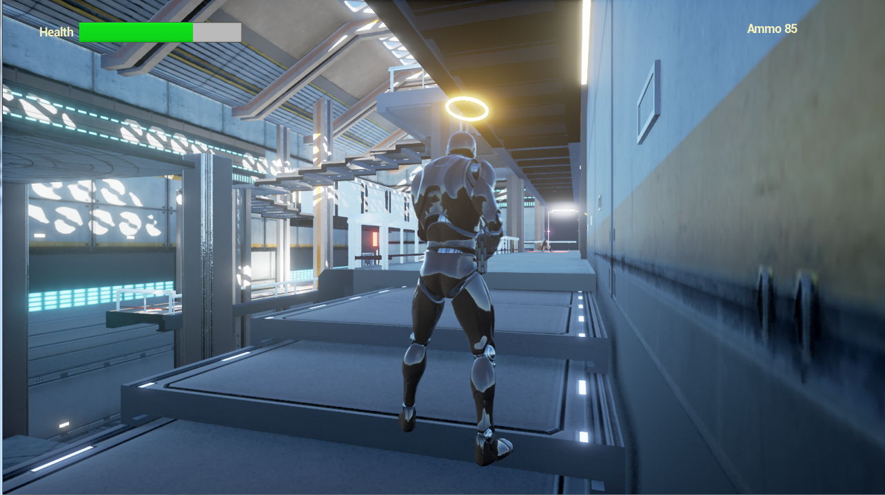
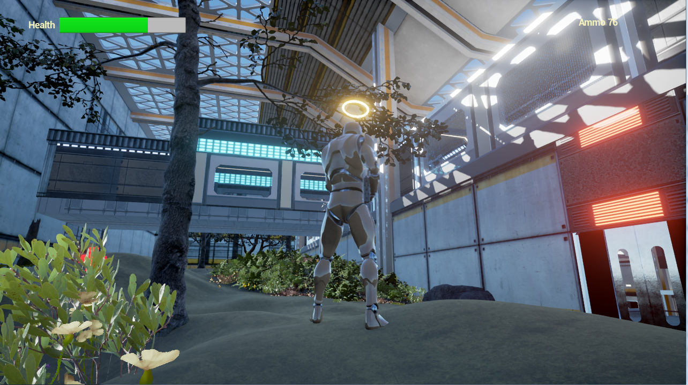
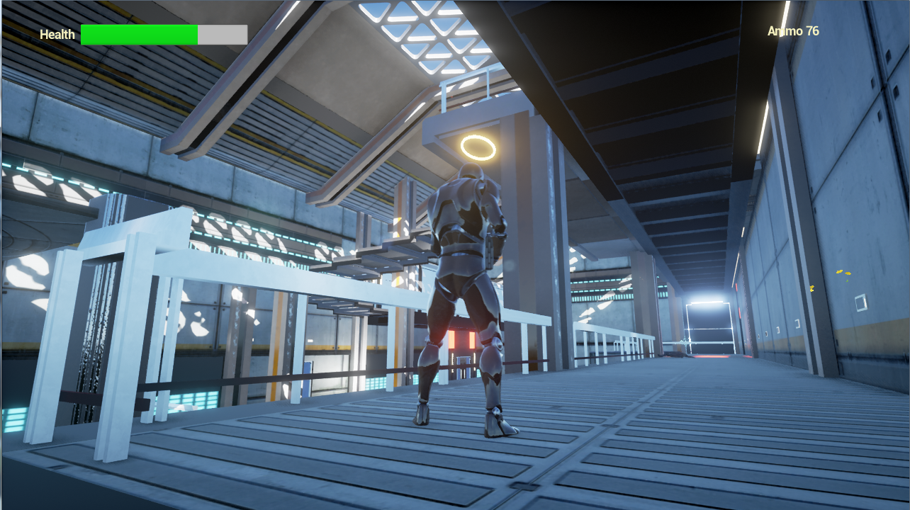

# Unreal-game-level

Modeling in 3dsmax, Maya, texturing, polygon optimization, level building, particle effects and game object behavior coding/scripting in C++

## gameplay video
https://www.youtube.com/watch?v=F2CHThdTbJY&t=35s

## screenshots

